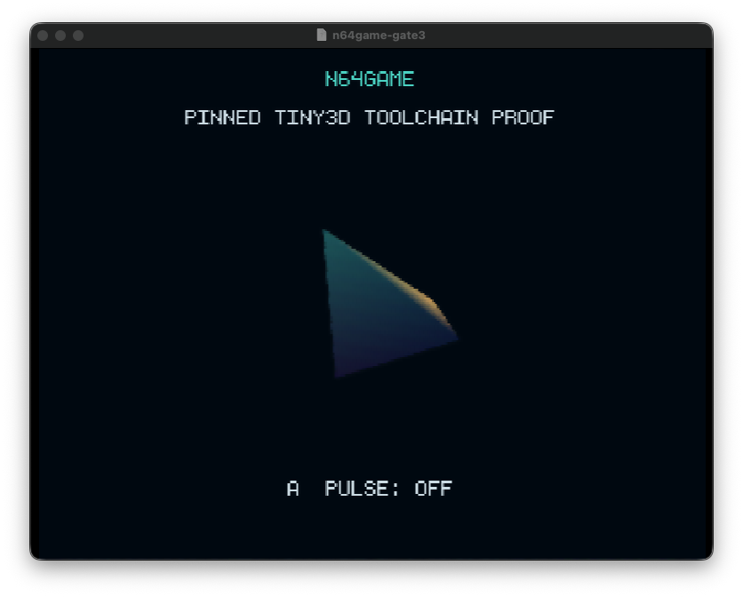

# N64GAME

`n64game` is an original Nintendo 64 creature-battler being built with libdragon and Tiny3D. The user-authorized one-week release target is a polished, complete 6–8 minute opening chapter with one finished Meridian Research Annex environment, one full 2v2 Resonance battle, saving/retry, and an original Solace-beacon corruption hook.

## Current status

**The reduced-scope player-driven spine is implemented. Gates 1–3 and the N64 runtime contracts are complete; visual approval, timed Ares certification, and production replacement are not.**

The development ROM now supports an input-only route through the Annex's Atrium, Simulation, Workshop, and Overlook sectors; four examines; functional Pause and Field Relay menus; a controller-driven Quarrune/Ayselor versus Gyreclast/Kivarrax 2v2 battle; retry/return restoration; EEPROM save schema v2 with canonical safe-anchor resume and request debouncing; the beacon ending; and a stable post-chapter archive. The route is exercised through controller input and save APIs rather than direct story-state mutation.

This is a playable implementation milestone, not a release or visual-quality claim. The Annex geometry, static Quarrune presentation, skinned/animated Ari player, and skinned/animated Gyreclast/Kivarrax opponents are reviewed runtime candidates. Gyreclast and Kivarrax now replace their battle tetrahedra with original 3D models and event-driven `idle_a`, `reposition`, and `hit` clips; a fail-closed post-build audit verifies their skeletons, clips, texture bindings, and hardware palette profiles. Ayselor remains a temporary battle stand-in, Quarrune still needs its reviewed animated replacement integrated, and the repository still contains **zero approved production 3D/texture asset packages**. Final art approval, audio, VFX, lighting, camera staging, real-time pacing, and the complete timed Ares run remain unverified. The reduced scope cuts the Estate, world map, second battle, follower system, and extra four Echoforms so remaining work can concentrate on a coherent finished slice without lowering the art bar.

The exact libdragon, Tiny3D, CLI, container, Ares, and CI dependencies are locked, with public gitlinks and stable build entry points under `scripts/`. A clean Docker Desktop build and fresh public CI build previously produced identical Gate 3 diagnostic ROM bytes, and those exact historical bytes rendered advancing frames in pinned Ares 148; the audit is recorded in [docs/GATE3_BOOT_EVIDENCE.md](docs/GATE3_BOOT_EVIDENCE.md). That proof validates the pinned runtime path only. It does not certify the current gameplay ROM.

The authoritative production contract is [docs/N64GAME_MASTER_SPEC.md](docs/N64GAME_MASTER_SPEC.md). The reusable goal prompt is [docs/N64GAME_GOAL_PROMPT.md](docs/N64GAME_GOAL_PROMPT.md).



This screenshot is the small Gate 3 diagnostic—not gameplay or representative production art. Its rotating Tiny3D solid proves the pinned render stack is alive; the `A` button toggles the diagnostic pulse state.

## Current controls

- Analog stick or D-pad: move
- Hold `B` while moving: run
- `A`: interact, confirm, or advance dialogue
- `B`: back or cancel
- `Start` or `Z`: open or close Pause
- `C-down`: open or close the Field Relay after it is unlocked

## Creative direction

The game uses an original retro desert-science-fiction setting:

- Creatures: **Echoforms**
- Team energy: **Resonance**
- Corrupted creatures: **Fractured** Echoforms
- Home: **Meridian Research Annex**
- Player team: **Quarrune** and **Ayselor**
- Simulation opponents: **Gyreclast** and **Kivarrax**

Pokémon XD: Gale of Darkness informs only the high-level pacing and functional rhythm of the opening. Pandemonium is an engineering and presentation reference. No Pokémon or Pandemonium code, characters, assets, maps, dialogue, music, UI, or protected expression may be copied into this project.

## Technical target

- Standard 4 MB Nintendo 64; no Expansion Pak requirement
- 320×240, 16-bit color, triple buffering, 30 FPS target
- libdragon preview and Tiny3D with exact dependency pins
- EEPROM4K saves
- Reproducible Docker-based builds
- Ares 148 Homebrew Mode as the first certification target
- Public CI-generated `.z64` and SHA-256 artifacts

The reproducible build contract and exact commands are documented in [docs/TOOLCHAIN.md](docs/TOOLCHAIN.md). Generated ROMs and reports stay under ignored `build/`; ROM binaries never enter normal Git history.

## Build and run the current development ROM

```sh
git clone --recurse-submodules https://github.com/oh-ashen-one/n64game.git
cd n64game
git lfs install && git lfs pull
npm ci --ignore-scripts
make validate
make rom && make test && make report
scripts/run-ares --homebrew-mode \
  --expected-rom-sha256="$(shasum -a 256 build/game/n64game-gate3.z64 | awk '{print $1}')" \
  build/game/n64game-gate3.z64
```

The artifact still carries the historical `n64game-gate3.z64` filename for build-contract compatibility; its filename is not a Gate 3-only gameplay claim or a release label. Docker Desktop is the verified build runtime, and Ares v148 Homebrew Mode remains the first certification target. See [the toolchain guide](docs/TOOLCHAIN.md) for exact versions, host checks, outputs, the historical Docker Desktop proof, and the separately documented fallback. A successful local build or host test does not substitute for the pending timed Ares route, soak, and final public artifact evidence.

## Licensing

Original source code is licensed under the [MIT License](LICENSE). Original and generated non-code assets—including art, models, animation, audio, writing, characters, creature designs, and world content—are governed separately by [ASSET_LICENSE.md](ASSET_LICENSE.md) and are All Rights Reserved unless an asset-ledger entry explicitly says otherwise.

Third-party components retain their own licenses. See [THIRD_PARTY_NOTICES.md](THIRD_PARTY_NOTICES.md).
